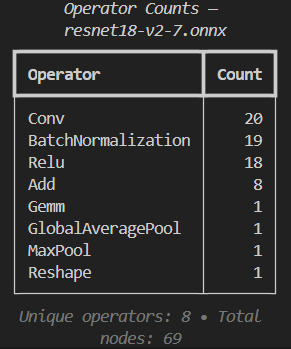

# onnx-card

A minimal terminal tool to display **operator counts** for ONNX models.

`onnx-card` loads an ONNX model and prints a clean table of operator types
(`node.op_type`) and how often they occur in the graph.



Built for:
- quick inspection
- terminal-first workflows
- scripting and CI usage

---

## Installation

From source (development):

```bash
pip install -e .
````

Once published on PyPI:

```bash
pip install onnx-card
```

---

## Usage

Basic usage:

```bash
onnx-card model.onnx
```

Limit output to top operators:

```bash
onnx-card model.onnx --top 10
```

Sort alphabetically instead of by count:

```bash
onnx-card model.onnx --sort name
```

JSON output (for scripts / CI):

```bash
onnx-card model.onnx --json
```

You can also run it as a module:

```bash
python -m onnx_card model.onnx
```

---

## Example output

```
┏━━━━━━━━━━━┳━━━━━━━┓
┃ Operator  ┃ Count ┃
┡━━━━━━━━━━━╇━━━━━━━┩
│ Conv      │    53 │
│ Relu      │    49 │
│ Add       │    24 │
│ BatchNorm │    16 │
│ Gemm      │     1 │
└───────────┴───────┘

Unique operators: 5 • Total nodes: 143
```

---

## What this tool does

* Counts operators in the **top-level ONNX graph**
* Uses `node.op_type` exactly as defined by ONNX
* Produces terminal-friendly output using **Rich**

---

## What this tool does *not* do (by design)

* No model execution
* No shape inference
* No MACs / FLOPs
* No visualization
* No recursion into subgraphs (yet)

The goal is to stay **small, fast, and predictable**.

---

## Requirements

* Python ≥ 3.9
* `onnx`
* `rich`

---

## License

MIT
