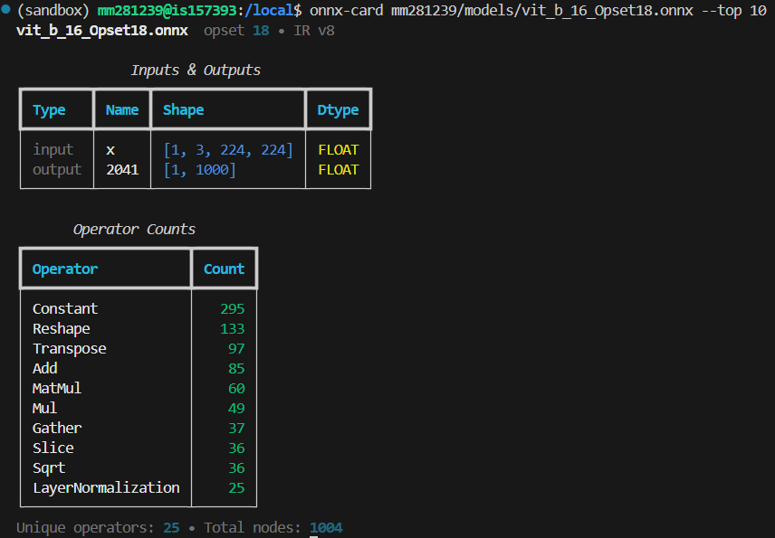

# onnx-card


A fast, terminal-first **ONNX model card** that answers:

> **“What operators, inputs, and metadata are inside this ONNX model?”**

`onnx-card` provides a concise, human-readable summary of an ONNX model
directly in the terminal — without executing the model.




---

## Installation

From PyPI:

```bash
pip install onnx-card
````

From source (development):

```bash
git clone https://github.com/boijuny/onnx-card
pip install -e .
```

---

## Usage

Basic usage:

```bash
onnx-card model.onnx
```

Show only the top operators:

```bash
onnx-card model.onnx --top 10
```

Sort operators alphabetically:

```bash
onnx-card model.onnx --sort name
```

JSON output (for scripts / CI):

```bash
onnx-card model.onnx --json
```

You can also run it as a module:

```bash
python -m onnx_card model.onnx
```

---

## Example


---

## Why onnx-card?

ONNX provides powerful APIs, but **no built-in CLI** to quickly inspect
what is inside a model.

`onnx-card` fills this gap by providing a **terminal-first model summary**
focused on inspection and understanding.

| Tool          | Terminal | Operator counts | IO summary | JSON |
| ------------- | -------- | --------------- | ---------- | ---- |
| **onnx-card** | ✅        | ✅               | ✅          | ✅    |
| Netron        | ❌        | ⚠️              | ⚠️         | ❌    |
| Raw ONNX API  | ❌        | ❌               | ❌          | ❌    |

---

## What this tool does

* Counts operator types (`node.op_type`)
* Displays model metadata (IR version, opset)
* Lists model inputs and outputs (names, shapes, dtypes when available)
* Produces clean terminal output using **Rich**
* Supports JSON output for automation and CI

---

## Scope and limitations

* Counts operators in the **top-level ONNX graph only**
* Does **not** execute the model
* Does **not** perform shape inference or profiling
* Focused on inspection, not performance analysis

These limitations are intentional to keep the tool fast and predictable.

---

## Design goals

* Terminal-first
* Zero model execution
* Minimal dependencies
* Clear and trustworthy output

---

## Requirements

* Python ≥ 3.9
* `onnx`
* `rich`

---

## License

MIT
